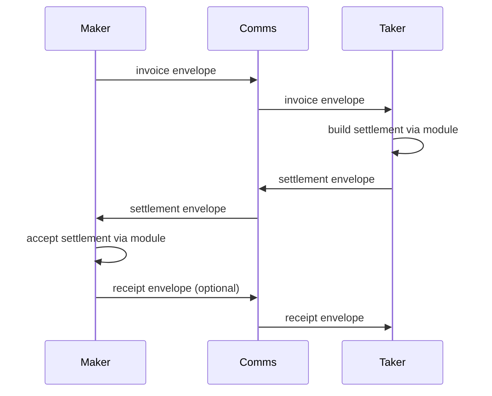
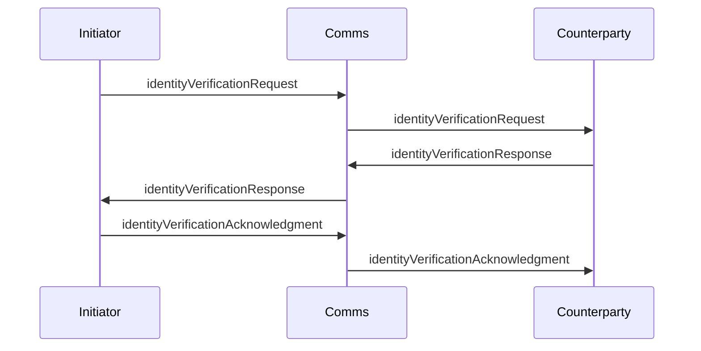

# Remittance Getting Started

This guide introduces the remittance subsystem and shows how to wire a maker and taker together using `RemittanceManager`, `CommsLayer`, and a module such as `Brc29RemittanceModule`. Identity verification is manager-managed, not module-managed, and it is always acknowledged before proceeding.

## Concepts

- **RemittanceManager** orchestrates threads, identity exchange, transport, and receipts.
- **RemittanceModule** builds/accepts settlement artifacts for a specific payment method.
- **CommsLayer** delivers protocol envelopes (store-and-forward and/or live).
- **IdentityLayer** handles certificate requests, responses, and acknowledgment.
- **ThreadHandle** gives you waiters (`waitForState`, `waitForSettlement`, `waitForReceipt`) for streaming or async flows.

## Sequence: Invoice to Receipt



## Sequence: Identity Exchange (when enabled)



Identity acknowledgment is required before invoicing/settlement proceeds when configured.

## Basic Setup

```ts
import { WalletClient, RemittanceManager, Brc29RemittanceModule } from '@bsv/sdk'
import { MessageBoxClient, MessageBoxAdapter } from '@bsv/message-box-client'

const wallet = new WalletClient('auto', 'localhost')
const messageBoxClient = new MessageBoxClient({
  walletClient: wallet
})
const commsLayer = new MessageBoxAdapter(messageBoxClient)
const brc29Module = new Brc29RemittanceModule()
const manager = new RemittanceManager(
  {
    messageBox: 'direct_payment_test',
    remittanceModules: [brc29Module],
    options: {
      receiptProvided: false, // Disable receipting
      autoIssueReceipt: false,
      invoiceExpirySeconds: 3600
    },
    logger: console
  },
  wallet,
  commsLayer
)

await manager.init()
```

## Sending the Payment (unsolicited settlement)
```ts
  const threadHandle = await manager.sendUnsolicitedSettlement(
    recipient,
    {
      moduleId: 'brc29.p2pkh',
      option: {
        amountSatoshis: amountSats,
        payee: recipient
      },
      note: `Direct payment test - ${amountSats} sats`
    }
  )
```

## Receiving the Payment (unsolicited settlement)

```ts
  // Payment will automatically be internalized when threads are synced.
  await testSyncThreads(manager)
```

## Event Hooks

Use `onEvent` or the per-event `events` callbacks to react to each step.

```ts
const manager = new RemittanceManager(
  {
    remittanceModules: [new Brc29RemittanceModule()],
    events: {
      onStateChanged: (event) => console.log('state', event.previous, '->', event.next),
      onSettlementReceived: (event) => console.log('settlement', event.settlement)
    }
  },
  walletInterface,
  commsLayer
)
```

## State Machine and Auditing

Threads follow the `RemittanceThreadState` state machine, and every transition is recorded in `thread.stateLog`.
Use `REMITTANCE_STATE_TRANSITIONS` to validate transitions or to build a visualizer.

```ts
const thread = manager.getThreadOrThrow(threadId)
console.log(thread.state)
console.log(thread.stateLog)
```

## Live / Streaming Mode

If your `CommsLayer` supports `listenForLiveMessages`, call:

```ts
await manager.startListening()
```

This keeps state current while you use `ThreadHandle.waitForState` to await transitions.
